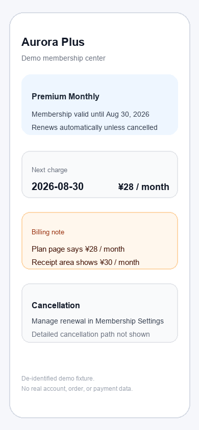

# SubClear

A subscription management MVP that turns fragmented subscription information into clear, reviewable records.



## Overview

SubClear is a product prototype for managing subscriptions, trials, renewal dates, prices, cancellation notes, and status in one place. It is designed for a common problem: subscription information is scattered across app stores, membership pages, receipts, and screenshots, so people lose track of what renews, what needs review, and what can wait.

The current app organizes that information into structured subscription records. Users can add records manually, upload a screenshot for AI-assisted extraction, review the extracted fields in an editable form, confirm the record, then manage renewal, reminder, cancellation, and export workflows.

## Core Product Flow

```text
Manual Entry or Screenshot Capture
        |
        v
AI extraction / prefill when available
        |
        v
Editable review form
        |
        v
User confirmation
        |
        v
Subscription record
        |
        v
Renewal, reminder, cancellation, and export management
```

## Key Features

- Action-first Home overview for records that need review, expire soon, renew soon, or have active cancellation tasks.
- Subscription record library with filters for review, expiration, upcoming charges, auto-renewal, cancellation tasks, and expired records.
- Manual entry flows for free trials and paid memberships.
- Screenshot upload flow with PNG, JPEG, and WebP validation, temporary preview, and manual fallback.
- Gemini-backed screenshot extraction endpoint when `GEMINI_API_KEY` is configured.
- AI extraction normalization, issue handling, evidence metadata, and user-confirmed save into the canonical record model.
- Subscription detail, edit, delete, simulated reminder settings, cancellation planning, and mark-complete flows.
- Local `localStorage` persistence with migration handling and CSV/JSON export.

## AI Approach

SubClear uses Gemini through a local Express backend, not directly from the browser. The frontend uploads a user-selected screenshot to `/api/extract-subscription`; the server validates the file, keeps the Gemini key server-side, sends the image to Gemini with a structured JSON schema, then normalizes and checks the model output before returning fields to the client.

The product principle is **Evidence before confidence**. AI output is treated as a draft, not as final truth. Extracted fields carry evidence metadata such as source text, evidence type, review status, and model confidence where available. The review step maps that draft into the same editable subscription form used by manual entry, so the user can fix or confirm every field before saving. If extraction is unavailable or unreliable, the flow falls back to manual entry.

## Demo

The public repository currently includes one safe, de-identified fixture image:

- `public/fixtures/subclear-membership-demo.png`

This asset contains no real account, order, payment, email, phone, API key, or local-path data. The local real validation screenshot is intentionally ignored and is not part of the public repository.

Hosted demo URL: not published yet.

Screen recording: not included yet.

## Current Status

Functional MVP / local product prototype.

Implemented:

- Manual subscription entry and editable subscription records.
- Home action overview and subscription library filters.
- Screenshot upload shell with safe file validation and temporary image preview.
- Real Gemini multimodal screenshot extraction path when the local AI backend is running and `GEMINI_API_KEY` is configured.
- Screenshot extraction response normalization, issue detection, evidence metadata, and AI-prefilled shared form.
- User confirmation before any AI-extracted record is saved.
- Reminder configuration as simulated app state.
- Cancellation planning and completion tracking.
- Local persistence, migration handling, and CSV/JSON export.
- Automated regression coverage across app routing, storage, AI contracts, extraction, review, reminders, cancellation, and export.

Experimental / Partial:

- AI capture is a prototype-grade local path, not a production OCR system.
- Broad real-world screenshot robustness has not been validated at production scale.
- The stable public demo asset is de-identified; real personal subscription screenshots are kept out of Git.
- Reminders are simulated and do not send real notifications.
- Evidence is preserved as metadata and review state; it is not a separate automated verification system.

Not in the current MVP:

- Voice Quick Add is disabled.
- Bank, payment, email, SMS, or photo-library integrations.
- Automatic subscription cancellation.
- Production deployment, authentication, billing, or multi-device sync.

## Tech Stack

Frontend:

- React 19
- TypeScript
- Vite
- React Router
- Tailwind CSS

Backend:

- Express 5
- Multer memory uploads
- CORS
- dotenv

AI:

- `@google/genai`
- Gemini model: `gemini-3.5-flash-lite`
- Structured JSON schema response

Data and quality:

- Browser `localStorage`
- CSV/JSON export
- Vitest
- Testing Library
- Supertest
- ESLint

## Local Development

Install dependencies:

```bash
npm install
```

Create a local environment file:

```bash
cp .env.example .env
```

Set `GEMINI_API_KEY` in `.env` to enable real Gemini screenshot extraction. `SERVER_PORT` defaults to `3456`. The frontend defaults to `http://localhost:3456` for the AI backend, or you can override it with `VITE_AI_API_BASE_URL`.

Run the app in two terminals:

```bash
npm run dev
npm run dev:ai
```

Quality checks:

```bash
npm run lint
npm test
npm run build
```

## Repository Structure

```text
src/pages/              Product screens and routes
src/components/         Shared UI components
src/ai/                 Extraction schema, client, and normalization
src/subscriptionForm/   Manual and AI-prefilled form logic
src/store/              Subscription state provider
src/storage/            localStorage persistence and migration
server/                 Local Express AI extraction backend
public/fixtures/        Safe de-identified demo fixture
```

## Quality

Current automated coverage includes 39 test files and 323 passing tests across the core product, AI extraction contracts, storage, review, reminder, cancellation, and export flows.

## Product Boundaries

SubClear does not connect to banks, process payments, cancel subscriptions externally, scan background data sources, store raw screenshot binaries, or send real notifications. It is a local MVP intended to demonstrate product thinking, AI-assisted capture, human confirmation, and subscription management workflows.

## Development

SubClear is an independent product project. Product definition, UX direction, AI behavior, and acceptance criteria were human-led, with AI coding tools used for implementation and review.

## License

No license file is currently included. This public repository is not automatically granted an open-source license.
